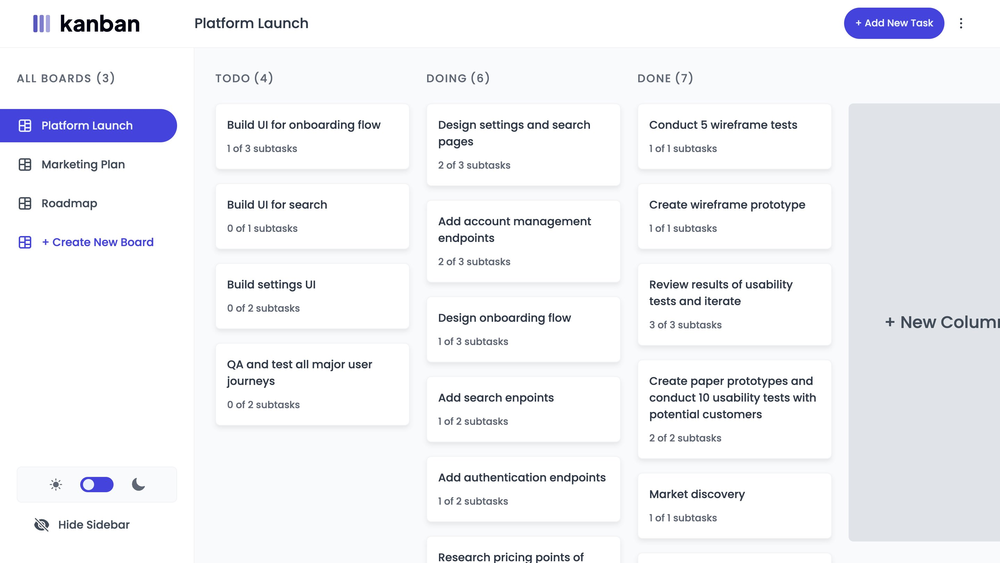
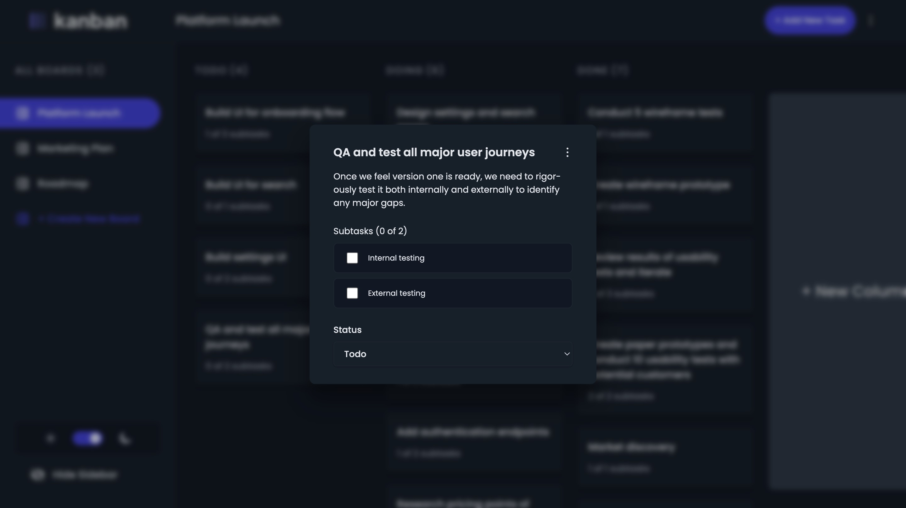
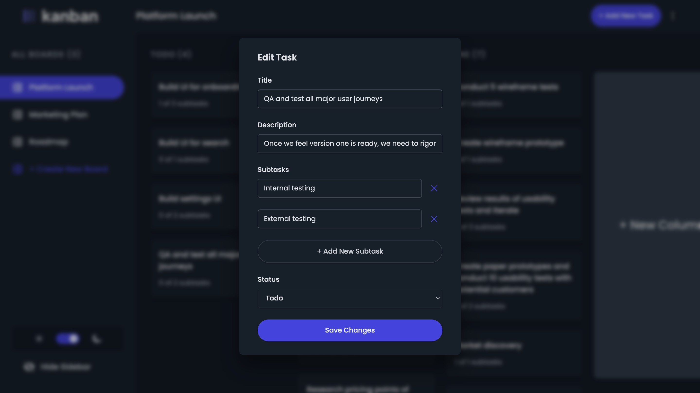
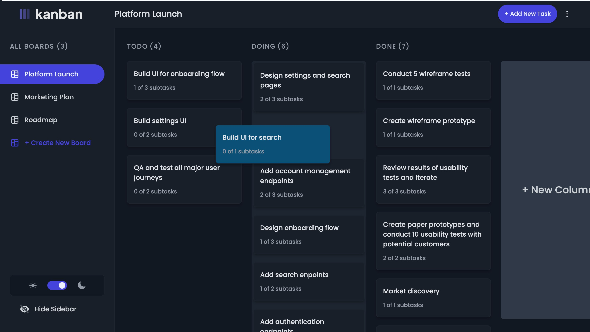
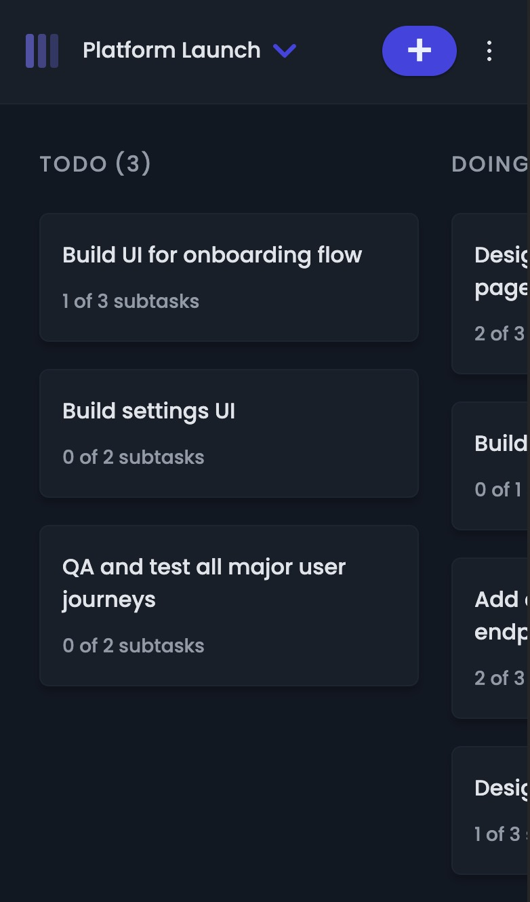

# Kanban Task Manager - Web App

The Kanban Task Manager is a React-based web app that lets users create tasks, drag and drop tasks and add subtasks to them. Comes with dark mode and responsive design.



## Features

### 1. Drag and Drop

Tasks can be intuitively moved across different columns (e.g., To Do, In Progress, Done) using drag and drop functionality.

### 2. Dark Theme

The app supports a sleek and modern dark theme for a comfortable and visually appealing experience, especially during extended usage.

### 3. Task Details

Users can view and edit task details, including task name, description, subtasks and status. Each subtask can be marked as completed.

### 4. Column Management

Easily customize columns based on your workflow. Add, remove, or rename columns to suit your project needs.

### 5. Boards

Create more boards, switch across boards and edit or remove a board, seamlessly.

## Libraries Used

- [react-beautiful-dnd](https://react-beautiful-dnd.netlify.com/): Used for implementing drag-and-drop functionality in the Kanban board.
- [react-hook-form](https://react-hook-form.com/): Utilized for managing forms and handling user input efficiently.
- [redux-toolkit](https://redux-toolkit.js.org/): Employs Redux Toolkit for state management, ensuring a scalable and maintainable application state.
- [styled-components](https://styled-components.com/): Styled components are used for a clean and maintainable way to style React components.

## Screenshots

1. **View Task**
   

2. **Edit Task**
   

3. **Drag and Drop Task**
   

4. **Responsive**

- Mobile view
  

- Mobile navigation
  

## Getting Started

### Prerequisites

- Node.js installed on your machine.

### Installation

1. Clone the repository:

```bash
git clone https://github.com/arijit-malakar/kanban-task-manager.git
```

2. Install dependencies:

```bash
cd kanban-task-manager
npm install
```

3. Start the development server:

```bash
npm run dev
```
